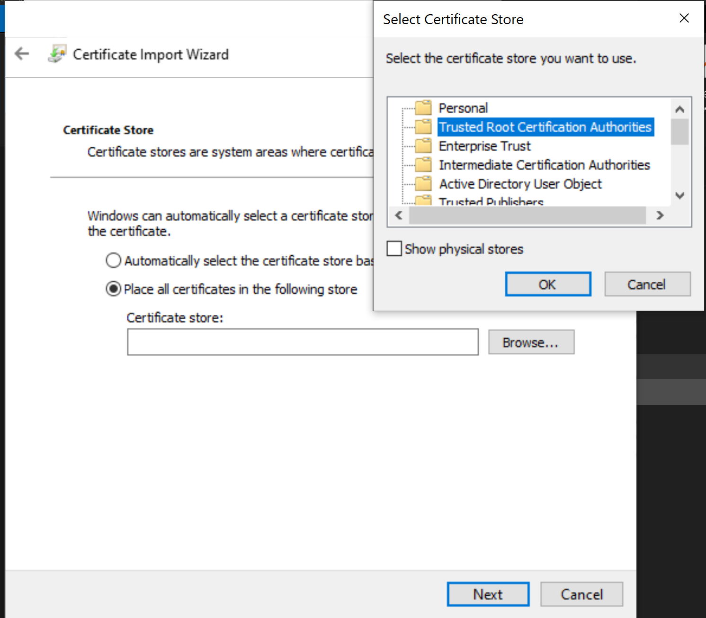

# TheIdServer

[TheIdServer](https://github.com/Aguafrommars/TheIdServer) is an [OpenID/Connect](https://openid.net/connect/), [OAuth2](https://oauth.net/2/) and [WS-Federation](https://docs.oasis-open.org/wsfed/federation/v1.2/os/ws-federation-1.2-spec-os.html) server based on [IdentityServer4](https://identityserver4.readthedocs.io/en/latest/).

## Install

Add the repository to helm :
``` bash
❯ helm repo add agua https://aguafrommars.github.io/helm
❯ helm install aguafrommars agua/theidserver --set mysql.auth.password=my-P@ssword
```

This install:

* A TheIdServer cluster with 3 replicas
* [A MySQL Master/Slave cluster](https://github.com/bitnami/charts/blob/master/bitnami/mysql/README.md) 
* [A Datalust SEQ server](https://github.com/helm/charts/blob/master/stable/seq/README.md)
* [A Redis cluster](https://artifacthub.io/packages/helm/bitnami/redis)

### Certificates

They are stored in the k8s opaque secret `<release name>`-certs.  

#### Get generated certificates

To get the list of secret in your namespace run:

```bash
kubectl get secret
```
ex:

```bash
❯ kubectl get secrets --namespace theidserver
NAME                                   TYPE                                  DATA   AGE
aguafrommars-mysql                     Opaque                                3      10h
aguafrommars-mysql-token-qsjc9         kubernetes.io/service-account-token   3      10h
aguafrommars-theidserver-certs             Opaque                                8      10h
aguafrommars-theidserver-opaque            Opaque                                4      10h
aguafrommars-theidserver-token-wq2rw       kubernetes.io/service-account-token   3      10h
aguafrommars-redis-token-9ckf2         kubernetes.io/service-account-token   3      10h
```

To get the list of a secret keys run:

```bash
kubectl describe secret <secret name>
```

ex:

```bash
❯ kubectl describe secret aguafrommars-theidserver-certs
Name:         aguafrommars-theidserver-certs
Namespace:    theidserver
Labels:       app.kubernetes.io/instance=aguafrommars
              app.kubernetes.io/managed-by=Helm
              app.kubernetes.io/name=theidserver
              app.kubernetes.io/version=1.1.0
              helm.sh/chart=theidserver-0.1.0
Annotations:  meta.helm.sh/release-name: aguafrommars
              meta.helm.sh/release-namespace: theidserver

Type:  Opaque

Data
====
signingKey.crt:      1103 bytes
signingKey.key:      1679 bytes
tls.crt:             1326 bytes
tls.key:             1675 bytes
ca.crt:              1135 bytes
ca.key:              1679 bytes
dataProtection.crt:  1103 bytes
dataProtection.key:  1679 bytes
```

Use the command to get a secret value:

```bash
kubectl get secret <secret name> -o jsonpath="{.data['<secret key>']}"
```

ex:

```bash
❯ kubectl get secret theidserver-certs -o jsonpath="{.data['tls\.key']}" --namespace theidserver
LS0tLS1CRUdJTiBSU0EgUFJJVkFURSBLRVktLS0tLQpNSUlFb3dJQkFBS0NBUUVBeW5mNVBMR21jVGJOMkpDRXM0eUpHS1JlUzhQVnVsaUtYZXVpK3VQSTUzdzJ5QW52Ckt3ZWpreXVKYzhDR3VQeDFLZEpQMWVrQmowY2NZUEtaRmVHcm9HNFNaT3ZoZW1PeVJma1A1VVNwNmNreEVXY28KU1FLemMzZWNaT0pFbUR1TjFtcytub2JuSk5ZcXJkT20yK00wM1ova3dnMmlIVHFZQ0diU3o3ajVvajlwOUo5MApia05vT0pLTnIwT3I1OFdkNDd3SFFSWEgvOU9GV25LTE5ORnhvV1BzdXlDeWlEeE0xMnRzOFVRVkZaN1dUYXk0CkMwTU5qYXVTYzlJN2FBREJhREdhVUFnZzJnbkZmb2EzNG1RbUdyUTk0eHA1VERvWUI4NHdOTHA5Y1NEUVRhVWsKQ2RtVWpIMW5jTjNtU2xnR3hiYkhnN21Dcjk1cm1EYTRuQUJYeVFJREFRQUJBb0lCQVFDTmpXRmdNS2U0UVdPYgpCRGJ5dk05Z3ZoSDdFSGlOcHJkZVFJOGFyMFJYcXYwMXo5UTVsa2FqYnUzVFVvZ2VMc3JQS1cyTmxURDA5ZmQrClJENEpFVlNIZmswMzU3NGxiaXhHUllINmZZMzVtQ0xKRXdFVVFtSXAyVGNyUlJKR0NHVDZ3dEh0elUwdThOaTMKM09Dc25PWHFDSTdMcVBKdFV2alY3dVYyT3RHMHZ6Z2ZVTDRuMlBJMFZTYVplUmE3aW9DbGtwNjQzWHhZamZxUgpxUnBqV2FiNzlJU0FnK0ZTRGJPS0tTQjFHdDRDcmZHbENYSXhIcjRJN0x4UGIwZnQ4L2ZyM3I5YzRXbWF5TWcyCmhsVVY3RW1tV1lCTkEzblYzcDNrZEcyZi9jREJZQzkrc1I3cTlLMEk3N21oZFlCSFZYUlFrVjRaYy9xRTN5YXUKejZ6TWNhMHRBb0dCQU5XNWZPa2M5YUNnYndXR0xIVGdjR2Z1TFNRQkljVGhjejZEMlZqdnZiY0tPV0NQMld5SgowN0VhOW1VVGFMWElnQ3d5QWlvM3ZzNXZCZ2xwQ1FXdGFNWWk3NEk4WVQ1ZVJRRXdTUDlHWThWRnJjUFVMdGEvCkp0cCtSNzc3T0NmSDhlcTJRbkZPK2tzdDBoTnZMTkdKUEN6SGUvcmsvcmo3ZitnWldOSDBjYnI3QW9HQkFQS0UKZ3kyRm5jRXNURmpGbjV2THYrY212RGNMUU9idVZlT3dseXhzVDJkbU5WVjRYT2NEQUUyYkFpajFWU0MvM1VsdApYM285YkNBdzJkdXY0OXZhRXBJdWlBTFFYeitjSHpmUnZuZ2RhUUJBK0IweU5ISyt1MDl4bkRMS2VQak5CUlBOCnhKYVBFaUZVR0JHVnZadnFUZ0tDNTdndTNMeGtIejhseFhLdmxyMExBb0dBUWtESjlBbkNLeFVRMVltT1puemMKMjVyOTYxZGVmSVhYRDk0WGxuWmJQVTZ5RXJrRkVaeDRQMEs0ZHdUWlJPRHV1c1NWM3ppQXNjWEEvVkhPTmpCWApkblNHQXIxczk4U0paNkRzUUJZMS80Vm1KSHEyT21QdlMzUXlFWVlYRmwzcEpIVnppMlNNT3BudHNaQ1pPQ3R1CnVBTHU4QXZrMnJzOEgxc2NLWm01VjlrQ2dZQk04NFVZSGF5WHpmR1B2VzFPcHhFR1RJRXVTaERXOWNzbEN6UjgKc1FWay9zWnZqMWlUS0oyaEFrMW1KNnBTVU83clRKd2VFbjFMblpTVEk3VitYaXpFVzZWbWx5MlI1bnoxWGtVOApvY0JlaHo3ekxLbjl1czErZ01NYVRxcWg3NVByMjcvRU1qT0RoY1o1VmZVckV1YWIzMk9kU3FsWjBiOGtiMXkrCmJqNjdUd0tCZ0NIaDhFOVh1eDF1K3lGdzZScUUvZFVZV2NOZExQb1BsaHI4M1dSeHRpQnYwV0lzN2hRTmFkb3YKT2NsZW0ya1Rsams4MFVabGZlQ09WeTM0YjdLdjdKUVQ4b1RIeFp2dVhSOXhjTldRMHVvWEVvcitjVU0xaVhlaQpZZUsrMDNtTzBJT3FReUdpdnFJNHV1Z3lkQjFaeU5YS0xhdE1iWG9JUDZmMlJsVzdXV2RyCi0tLS0tRU5EIFJTQSBQUklWQVRFIEtFWS0tLS0tCg==
```

### Test the installation

1. Extract the ca certificate using the method above
   ```bash
   > kubectl get secret theidserver-certs -o jsonpath="{.data['ca\.crt']}" --namespace theidserver | base64 -d >> ca.cer
   ```
2. Install the certificate in your Trusted Root Certification Authorities store
   
3. forward port 5443 to the service
   ``` bash
   ❯ kubectl port-forward service/theidserver 5443:https --namespace theidserver
    Forwarding from 127.0.0.1:5443 -> 5443
    Forwarding from [::1]:5443 -> 5443
   ```
4. Open a browser and navigate to https://localhost:5443
   You should be able to login with the user *alice* pwd *Pass123$*

## Upgrade

To upgrade the solution you need to retrieve certificates generated by the installation and MySql passwords.

#### Configure certificates

The following table lists the configurable parameters of the TheIdServer chart and their default values for certificates configuration.

|Parameter|Description|Default|Remarks|
|-|-|-|-|
|`ssl.create`|If true, creates Kestrel servers certificate.|true|If false, `ssl.crt` and `ssl.key` must be defined.|
|`ssl.cn`|The common name used to create the Kestrel servers certificate.|`<Deployment name>`||
|`ssl.ipList`|The IP list used to create the Kestrel servers certificate.|["127.0.0.1"]||
|`ssl.altNames`|The alternative name list used to create the Kestrel servers certificate.|["`<ssl.cn>`", "`<ssl.cn>`:`<service.port.https>`", "localhost", "localhost:`<service.port.https>`"]|if `ingress.enabled=true` and `ssl.altNames` is not defined, the chart add `"<ingress.hosts.host>"` and `"<ingress.hosts.host>:<service.port.https>"` to the alternative name list.|
|`ssl.validationPeriod`|The validation period in day to create the Kestrel servers certificate.|365||
|`ssl.crt`|The Kestrel servers certificate.|nil|This value is copied in `<deployement name>`-certs secret `ssl.crt`.|
|`ssl.key`|The Kestrel servers certificate key.|nil|This value is copied in `<deployement name>`-certs secret `ssl.key`.|
|`ssl.ca.create`|If true, creates Kestrel servers certification authority certificate.|true|If false, `ssl.ca.crt` and `ssl.ca.key` must be defined.|
|`ssl.ca.trust`|If true, add certification authority certificate in the tusted certificates repo.|true|The certification authority used to generate the Kestrel servers certificate must be trusted.|
|`ssl.ca.issuer`|Issuer to create the certification authority certificate.|"`<Deployment name>` CA"|
|`ssl.ca.validationPeriod`|The validation period in day to create the certification authority certificate.|3650||
|`ssl.ca.crt`|The certification authority certificate.|nil|This value is copied in `<deployement name>`-certs secret `ca.crt`.|
|`ssl.ca.key`|The certification authority certificate key.|nil|This value is copied in `<deployement name>`-certs secret `ca.key`.|
|`dataProtection.create`|If true, creates the certificate to crypt data protection keys at rest.|true|If false, `dataProtection.crt` and `dataProtection.key` must be defined.|
|`dataProtection.cn`|The common name used to create the certificate to crypt data protection keys at rest.|`Deployment name`||
|`dataProtection.ipList`|The IP list used to create thethe certificate to crypt data protection keys at rest.|nil||
|`dataProtection.altNames`|The alternative name list used to create the certificate to crypt data protection keys at rest.|nil|
|`dataProtection.crt`|The the certificate to crypt data protection keys at rest.|nil|Required for upgrade. This value is copied in `<deployement name>`-certs secret `dataProtection.crt`.|
|`dataProtection.key`|The the certificate key to crypt data protection keys at rest.|nil|Required for upgrade. This value is copied in `<deployement name>`-certs secret `dataProtection.key`.|
|`signingKey.create`|If true, creates the certificate to crypt signing keys at rest.|true|If false, `dataProtection.crt` and `dataProtection.key` must be defined.|
|`signingKey.cn`|The common name used to create the certificate to crypt signing keys at rest.|`Deployment name`||
|`signingKey.ipList`|The IP list used to create thethe certificate to crypt signing keys at rest.|nil||
|`signingKey.altNames`|The alternative name list used to create the certificate to crypt signing keys at rest.|nil|
|`signingKey.crt`|The the certificate to crypt signing keys at rest.|nil|Required for upgrade. This value is copied in `<deployement name>`-certs secret `signingKey.crt`.|
|`signingKey.key`|The the certificate key to crypt signing keys at rest.|nil|Required for upgrade. This value is copied in `<deployement name>`-certs secret `signingKey.key`.|

> Ssl and ca certificates can be regenerated at each upgrade but we recommand to not regenerate the ca certficate.

### MySQL passwords

Passwords are store in `<release name>`-mysql secret

To get the list of a secret keys run:

```bash
kubectl describe secret <release name>-mysql
```

ex:

```bash
❯ kubectl describe secrets aguafrommars-mysql --namespace theidserver
Name:         aguafrommars-mysql
Namespace:    theidserver
Labels:       app=mysql
              app.kubernetes.io/managed-by=Helm
              chart=mysql-6.14.10
              heritage=Helm
              release=aguafrommars
Annotations:  meta.helm.sh/release-name: aguafrommars
              meta.helm.sh/release-namespace: theidserver

Type:  Opaque

Data
====
mysql-password:              16 bytes
mysql-replication-password:  16 bytes
mysql-root-password:         16 bytes
```

Use the command to get a secret value:

```bash
kubectl get secret <secret name> -o jsonpath="{.data.<secret key>}" | base64 -d
```

ex:

```bash
❯ kubectl get secrets aguafrommars-mysql -o jsonpath="{.data.mysql-password}" --namespace theidserver | base64 -d
Th€IdS€rv€r-2o2o
```

### Create the upgrade.yaml file

With values retrieve from certificates and password secrets, create a file to configure an upgrade.

ex:

```yaml
# Default values for TheIdServer.
# This is a YAML-formatted file.
# Declare variables to be passed into your templates.

image:
  tag: "4.5.0"

# Dependencies configuration
mysql:
  auth:
    password: "Th€IdS€rv€r-2o2o" # The mysql user password is required    
    rootPassword: "My$ql-8.o.21" # The mysql root password is required
  
# Kestrel servers cerificates
ssl:
  create: true
  crt: LS0tLS1CRUdJTiBDRVJUSUZJQ0FURS0tLS0tCk1JSURwekNDQW8rZ0F3SUJBZ0lSQUxVbkJUSzJxcDJUdEZqSTlIYzNQcGd3RFFZSktvWklodmNOQVFFTEJRQXcKSmpFa01DSUdBMVVFQXhNYllXZDFZV1p5YjIxdFlYSnpMWFJvWldsa2MyVnlkbVZ5SUVOQk1CNFhEVEl3TVRBeApPVEEyTkRZeE0xb1hEVEl4TVRBeE9UQTJORFl4TTFvd0l6RWhNQjhHQTFVRUF4TVlZV2QxWVdaeWIyMXRZWEp6CkxYUm9aV2xrYzJWeWRtVnlNSUlCSWpBTkJna3Foa2lHOXcwQkFRRUZBQU9DQVE4QU1JSUJDZ0tDQVFFQXlUS1IKRzZlb3REZE0zYzg3WTVyazYrZlVIb2kzWDlGb0FyOU03bnF2SFdRVWN6ZU53dGQ2cmVUQjhIOE83N2FrUXEvUQpNeWFScHN3MkN6M2ZNTWpSRjhLTFAxNEJkMVlCdkV6NnBMM3NBbU1WOG1uS1FBaVpOdnRObFJSYngrdEVMSFpvCkFEbXNVblBhenE5Y3NPdHBKUWtwTlRSNnJuSDVGdXdEVkhSNG1veWczYUUzRER4UEUvTStXdXVxTDhZNERWUWEKNHh6amU2MUk1d2FqQVYyRzNLWEFtV2dIRTNqYzlzZE1DMmMwZXVrL2lQYnpPMkxoMmxhcGRCemtkSGtDbGhnbQpwTkcxYjlhK1BRQkZTdHlNSXBlVTVHUXR0TkpwenplamtzeXdSY3FFSEdzUWM5RUkrOS9wRTYyTk42bXBGOG4rCnIycGM2a2F2VGRRbFdLTFBOd0lEQVFBQm80SFNNSUhQTUE0R0ExVWREd0VCL3dRRUF3SUZvREFkQmdOVkhTVUUKRmpBVUJnZ3JCZ0VGQlFjREFRWUlLd1lCQlFVSEF3SXdEQVlEVlIwVEFRSC9CQUl3QURDQmp3WURWUjBSQklHSApNSUdFZ2hKaFozVmhabkp2YlcxaGNuTXViRzlqWVd5Q0ZtRm5kV0ZtY205dGJXRnljeTVzYjJOaGJEbzBORE9DCkdHRm5kV0ZtY205dGJXRnljeTEwYUdWcFpITmxjblpsY29JY1lXZDFZV1p5YjIxdFlYSnpMWFJvWldsa2MyVnkKZG1WeU9qUTBNNElKYkc5allXeG9iM04wZ2cxc2IyTmhiR2h2YzNRNk5EUXpod1IvQUFBQk1BMEdDU3FHU0liMwpEUUVCQ3dVQUE0SUJBUUI4WjFqeDJKNk9nakdGSnZHV3ErQW40U052a1BhN1V0cVJ0UmxwRmlydVZkMitselRJCnBTMy9BTllXNndlbUMvTG9PbUlQaU44NGNBQUhiMGlmam1Ha2ZXeTJGc3puNU5TSGx1aE1rUlFxMkl3MXZSMjgKSG5oaDZxejhXeU5wT1Y1TU1HMEJNYXdmSnJKZ3BuM3VrVk5VSE10Sk1xaE93QkxrNEhHWGZUWnhRMytPUThyawo3ZUtVN2Y3OUN6VTlCMUpJZ2ZIckp2bnAwVk02MnJ5NTB3UklwT2RablFrU1R4c3BOWGsvNWZPcVk0djJ0S1BGCjVsK3BNWW5uUGo1cUZjV2xmc3k5eGk0Lzh5RW41aE1WUHQwamkyQjZrdE9jS0w5SkdrTlNPbGM2cFp6N0pkUHMKbUNaNk5aTG96aDMxU1VxOUVvdi9OOG9DdTZaZWpvallZQWNwCi0tLS0tRU5EIENFUlRJRklDQVRFLS0tLS0K
  key: LS0tLS1CRUdJTiBSU0EgUFJJVkFURSBLRVktLS0tLQpNSUlFb3dJQkFBS0NBUUVBeVRLUkc2ZW90RGRNM2M4N1k1cms2K2ZVSG9pM1g5Rm9BcjlNN25xdkhXUVVjemVOCnd0ZDZyZVRCOEg4Tzc3YWtRcS9RTXlhUnBzdzJDejNmTU1qUkY4S0xQMTRCZDFZQnZFejZwTDNzQW1NVjhtbksKUUFpWk52dE5sUlJieCt0RUxIWm9BRG1zVW5QYXpxOWNzT3RwSlFrcE5UUjZybkg1RnV3RFZIUjRtb3lnM2FFMwpERHhQRS9NK1d1dXFMOFk0RFZRYTR4emplNjFJNXdhakFWMkczS1hBbVdnSEUzamM5c2RNQzJjMGV1ay9pUGJ6Ck8yTGgybGFwZEJ6a2RIa0NsaGdtcE5HMWI5YStQUUJGU3R5TUlwZVU1R1F0dE5KcHp6ZWprc3l3UmNxRUhHc1EKYzlFSSs5L3BFNjJOTjZtcEY4bityMnBjNmthdlRkUWxXS0xQTndJREFRQUJBb0lCQUhoM1Zuc0FmL3Fud2RadApabG5WUEl3ald0YU5kWDVobTYxSmJYNjg1bXpxcDNQMUoyUXFNTUk5M2dGcGtqL2xVNlM2TUNid1NQVmVBRjNxCnhlQW4zVW9rcWN0Zk5mR0dCYlFCUTNHd1pjZG9ISlB3MDdCVGRhbDkvbzNzaXFmQkxpaVJIT1JGby9BYWZrQ1MKcnlVZlR1MWw5czVzaGFnOWhhODcwU0tZT2o0T05jL1pRWWV6bURkSHR0cTRZVmhGZXdtT3oveUpnbWc1cDZlUApSQVAwM3doajgzbi9ncmJPK0ZzYW5tWTB4YjNmamowb2YxYmNhRGhYL21KdHErN3hZdzJ1ak9EUTk0OGhJMmYwCjF5dEhQNzcrSWRMOFppbUdBVDVpOWYzNkhML3NOZXlWNllBK2txSEoxbnZpVEhyWEJ6Tmp6TEE5eHN0OVhnR2kKVThSUTJNRUNnWUVBNTJZRDZPeGJZUnU4QlBuM2RtKzRFYmxmbS9LeG1ydGdMQlIwQTNZTkc3L0dHKy9GVm1zWApWM2lORW56T21uQmtqeGE1WUpOZVdGbG1hMGwwNFdjMWxwZ2V2RVQrZ2hMSndMS0JnN2liN2ttYnYvSTRJazNECkZ1UW4rRnRFRTl4V2JuVTBhekNVN3NtR2xDU2ZITVo5a0czc2t0Z2JwcDdoV1VEbWwzalpnSk1DZ1lFQTNwYVIKK0hqSG5mNUZPVUlxZEhhdWRmcUo2Uk00bk96TFVCRWErZ1lDeWpsTWNBUEFRSUpGSW5qVkVVL1hUM0VsREIzQQpJSVJ6WmU0Zk9UNnI0b0dkczBxODIwVGJJWjRoRVZDQ05OeWl4UE5hdGYweU1oY1RPR0JPOHQ2ejZZbXpuYWpPCmJtdlc0a3dNM29hZHBwVmUwRFNzMUpBMDFOR0FUemhNQ2J2Wk1VMENnWUFzRHJKajRNeXRPcGliNGZRSjZzK0QKSUdaaHpOMmY5bGtqUzJtalZ4QzczZEdjZEJTQWxiZEdBai9wNnpWekZqOHZOMFpvYXVhbHI2L2VjWWY5ZXFjcgpXeDlPL1Z2djdCL1p2cU1HTDFvUkRwYkcveGxNL3IxTVdIaDd3dlM5UzFCeGk0TkZmV1I5Nm9UakkrM2Zqck5OCmtvQmVuU0wyb0gyTGZ0M29yU3ZNWFFLQmdGWW1KcWJwY0RFSkdaZTRzUi9VVTErY01VWkJSemNOT3Y5cEwyeTMKYU5zRjVEeXladlZRdGh0S2N3UzVSeGNiTG9DSy96SldzU2N4UzJwbmhEVXRmM0RHSzJRZU9VWEFvd0hGakMrVAplWGdLekFBRjJDaWszNjZCTCswMkhxSHp4czN0YU1BNkFyZ2hRUlhiT2ljZ1Jzc0VxQ081RUltUjhEdzVDTXozCnBHODlBb0dCQU9UYkhDMjF6UDBjSktyRmFxV1ZPdFdWVExIb0hPaU9tWHE2blI4akorK2tLaVhZVS84UzYweWEKMlZNbnBhK0hTNjE5bjc0N0RMd1lBWkhOcC9hcXkzZXg3OGQzVW44cGJGQUlBcFc3enhwS2JLb25HNUtGbmhYZApBQ1JwSmw1ZVAwYitNTkljZEp2UkJSVVlPdHYxQWwvMW9QeTN4ZDJsM3pzUzdwUytycXllCi0tLS0tRU5EIFJTQSBQUklWQVRFIEtFWS0tLS0tCg==
  ca:
    trust: true
    create: false
    crt: LS0tLS1CRUdJTiBDRVJUSUZJQ0FURS0tLS0tCk1JSURHRENDQWdDZ0F3SUJBZ0lRUzRtL2JNTGRvZWo3M3JoVTdjeHdJREFOQmdrcWhraUc5dzBCQVFzRkFEQW0KTVNRd0lnWURWUVFERXh0aFozVmhabkp2YlcxaGNuTXRkR2hsYVdSelpYSjJaWElnUTBFd0hoY05NakF4TURFNQpNRFkwTmpFeldoY05NakV4TURFNU1EWTBOakV6V2pBbU1TUXdJZ1lEVlFRREV4dGhaM1ZoWm5KdmJXMWhjbk10CmRHaGxhV1J6WlhKMlpYSWdRMEV3Z2dFaU1BMEdDU3FHU0liM0RRRUJBUVVBQTRJQkR3QXdnZ0VLQW9JQkFRQ2YKdHc0SmlIbTZtSDN0a0tiSDdNZDQ2dVc2SXM2b3prSk9hZm51RlpaTTJMVnJ3VGgzbkg2N014SkZpd3ZEUVczQgorb1N4a0twVEdMenNEWGZJTDlwdDZ2c3pHbXJseFAzbUYwTnQxRzBqbjE3d0J3anVGZUNyZ3ZpdGxwOFBqYU93CldWYWpndjVhaTMydkFDWFRMMHlHNTVqQjJzRHZTNWZpL0gvaW92aDhqckoxcnd1SU1oUDNIYjU4UHl1VzRrT0wKMmhWNzJHL3RHR2k1eUI1VDdadG85cEFnNlhBY2ZjOE1WOXpRN0FjZExGcWFWK1dUNm9uWnNScDQrVTBKdytWdwpRY3djdlpXaWQwWDdiNXRBU2hIdzFCYy96aVhtQmo0ZFZBWUVxeGhIRnFJSWtnRllHU0F5Z0cwV0lXRXRQTmk1CjAxVlIwZG00SGVyQ0U2U0lhTzJqQWdNQkFBR2pRakJBTUE0R0ExVWREd0VCL3dRRUF3SUNwREFkQmdOVkhTVUUKRmpBVUJnZ3JCZ0VGQlFjREFRWUlLd1lCQlFVSEF3SXdEd1lEVlIwVEFRSC9CQVV3QXdFQi96QU5CZ2txaGtpRwo5dzBCQVFzRkFBT0NBUUVBbkkzWklmd1MrUk1HUjRKQUdWRWdoVzQzRjk0TTJjMXAyQWJmQmd5QzNnRzR0RjZwCmZBRXBuLzhwS1Y0SE84TVZ6bGR1cklHaDBORVRVMDJPMUpMS1lZMWdPSlhOUW5ucnBlajQ1aFYxVmIxQ3hmbnMKWXBiNjNIWkJUeHZESjRGQW1UaDRNSGxkdlJ3ZFhCVVVESk5sNkxxcmttYVJIWGdLdFJneDRUMzFCZ0JtWDMzdApzWm1pZm1PTzB0QjRMS3dNRUFEOWU4WFdRSlNFVlVxbFlZakltaGI4Yml0bDlXN0llL0dYM2orQ3M3ZWtyY0hjCnJIdVExL283dkxlLzJRTzA4WERFUDlGMFl4RlFzNS9RK21lU0xwalAzWUJsbGIwUUtnbnlCdzlhM3kwU0U5ZGQKYnZaMkhKVDVML0JqL256Nmo4Q05kektJS0RRMzFocU14NDZ6eVE9PQotLS0tLUVORCBDRVJUSUZJQ0FURS0tLS0tCg==
    key: LS0tLS1CRUdJTiBSU0EgUFJJVkFURSBLRVktLS0tLQpNSUlFcFFJQkFBS0NBUUVBbjdjT0NZaDV1cGg5N1pDbXgrekhlT3JsdWlMT3FNNUNUbW41N2hXV1ROaTFhOEU0CmQ1eCt1ek1TUllzTHcwRnR3ZnFFc1pDcVV4aTg3QTEzeUMvYWJlcjdNeHBxNWNUOTVoZERiZFJ0STU5ZThBY0kKN2hYZ3E0TDRyWmFmRDQyanNGbFdvNEwrV290OXJ3QWwweTlNaHVlWXdkckE3MHVYNHZ4LzRxTDRmSTZ5ZGE4TAppRElUOXgyK2ZEOHJsdUpEaTlvVmU5aHY3UmhvdWNnZVUrMmJhUGFRSU9sd0hIM1BERmZjME93SEhTeGFtbGZsCmsrcUoyYkVhZVBsTkNjUGxjRUhNSEwyVm9uZEYrMitiUUVvUjhOUVhQODRsNWdZK0hWUUdCS3NZUnhhaUNKSUIKV0JrZ01vQnRGaUZoTFR6WXVkTlZVZEhadUIzcXdoT2tpR2p0b3dJREFRQUJBb0lCQVFDVVBuYTdCbi9tWUhCUwpOemQyemlILzdCZTdBMS9LYzFnOExFV2RaVkFTbC9zY3YwWElUK3VabWpmVmNOQkVOZERJZ2R6MGE1Q01mS091CmZubTF5Q1Q0Yldrbjc5ZFUyZG5JM2NMcWlJZWN6dXB4NURXM3Qzckg5MU1XM0gxYkZGN2c2cXR1TGNJbERPQmwKdEw5bkc3bnVaYnoyQWpPZWFRM2IwLzVud0ZqZ1VxTTFKQy9LR2I2cXVVeW16WmhGUTdyL3dEL0ttN1B2SWhQUAp6akZRckZ6TFJ1cTN5SzlaaWRiTXMvekZHWnQ3Y1BoaUpJaXprT1ZhYlE5RjBhK01ZOFRlTjJibGVpUVcwZDZBCjhXWFJIZWU5R1A1ejQrZmExY0xtTElTL1ZWV1V6ZVVtS1BHcjVPWE9rWU9vZGFmR2REd0d4aXNENU5VRjBLcVAKa0tUNnp4UGhBb0dCQU1GRFZSam9pZ3krZGhHTEUweWxNWTBjZ1UxanNDdS84dUFQMEZNV0Nuc1gxSVlydmNVTQoyOXNzWU5TS09aN0VZOWRrL3ZsYUZSRHgxbERWM2d6ZzQrZkJjUWNuMzVleFo2dHlOSTR1TXZybHUreGQrb1JoCkZrUmdZUmgyRWJVM05meFBsNWN2ZW9pVUVVNklpVmtRUUFnOURHbE9CUFgxa29qM2JWOThJN2xwQW9HQkFOT1AKekY4ZjdHZGtEWHNIaUxhU3NuaDlIcmxKRWV6eTBVU3VYcllIQzBidlo5TE1mb1QzR2N5b2d0a0FsU0dVM3AyMQpZYUYxU3VTQWM0ZkhsTTArVU5CdkJjN1h1VFpCVEtkK29sdGN6TDFzcEtmbkxhYVhjSG83RWZsWmg3L3Mwc2JJCnJ3aWNsL1BjcDVaZUpwUk4vWjdTeml0MkQzYW9TUGlZb1padTZHRXJBb0dBUEdLS2F6NzFLMmd6UWVYL2dMbzQKMGt0dXh6eDNwaVBTZ2xuT2tMZFpUUDYwSTd2MURtV25LRU1rZWlRNlByWkVMOS9abnhXYmNYRHVzdEV3RVR3UApXYkZpWEljRDRNVElqSlFoZ2E5RHRJc2xmWVFicTFNZWZ2elNPYTlpZHdtcUw0eTY0NzBzL3hHc21xb2txQlJnCnZYSTl0NFZ1SFYrK2lsY3M4R0c4VThrQ2dZRUFveERKUStERlJJUFg2Q1pNZC96bVZ2eUp1K0xZVUR4d2xIR2EKU3M5dkg4UFQwS1VTTjhhR09qc0FiK2FGREJkRTUyWXcxRlFsMzY0cVhsTzFHK1dXUUxIeVZoWHNpaWNXd0Z0WgpKUGFJVU5EMnNQdjlNZFMwTzJKZ1hrTmw0TWJYUjZUVFZOM3VPV2F3UGJSZ0pCdGhDeFFOR1c2c1NKYzVkM09kCnlPZS9jWFVDZ1lFQWowdE5aU0txZDBCcXdHaE1kZkoraWNlZWhsZ1R4ekFDYjUzVXNPM3loOHU2YmVjZ1RyRW8KTmRxRVRLZTRBK01JTnJxelg4QmZVWFNlN1VOeEQ1TWlJYitLR0xLTHNudkpUVk83bTJpQUZRRlluVE1TTDVMRQp2MTBBa3JzZWJLSmRUNDdUZWQwaVg4VndSNkxOeXlNMUdIaStzWk81WmN4ck02V3ZvLzVGTk1JPQotLS0tLUVORCBSU0EgUFJJVkFURSBLRVktLS0tLQo=
# Certificate to crypt data protection keys
dataProtection:
  create: false
  crt: LS0tLS1CRUdJTiBDRVJUSUZJQ0FURS0tLS0tCk1JSURBakNDQWVxZ0F3SUJBZ0lRV3FTOUpxK0t1bHF5Rll6UEI1cFFxVEFOQmdrcWhraUc5dzBCQVFzRkFEQWoKTVNFd0h3WURWUVFERXhoaFozVmhabkp2YlcxaGNuTXRkR2hsYVdSelpYSjJaWEl3SGhjTk1qQXhNREU0TVRZdwpPRFEwV2hjTk1qRXhNREU0TVRZd09EUTBXakFXTVJRd0VnWURWUVFERXd0MGFHVnBaSE5sY25abGNqQ0NBU0l3CkRRWUpLb1pJaHZjTkFRRUJCUUFEZ2dFUEFEQ0NBUW9DZ2dFQkFPaURVTUpETG5tWTRDQnJkdHp6bHRiRDhDQVAKMEpETm9JZ1JlZkw2aXBmQ3JUcXdBNWZSZXQxN2xpdHlXTGpjNVlmSThCTWhMR2dobnhWWk5xNWJTQ3hEaHNMTAova1MyREszYm5CRlhJSTM4K1g4TFdpZ0JuZjZHOHcySDhXUlNxemlDTWloSnlNd1Z5N2MxNDhZdDMycU5pdm9hCmMydVJ0bmZUZ0FmdjhDZzY5VDMrOUN4SlVNeVdyMGp2WVlsTWFoNWpESlRiOWJBb1oyTjQrM0ZFU3BCSGR2Qm8KbXZWVzkvRlRvUjhvU3g3a05lUy9OMjJpTTUycklLbnVGbitFaUYyRWkrNGhOMzRkeEtlRkZTRXJnNW9iSWZIQgpTaGJwZGRGb2lkcUt4MnVTZmxlL29tWk83aHFqYXp1KzAxR1NwS0tlRUNaODBJcUlVV3Z4aUgvRXZkVUNBd0VBCkFhTS9NRDB3RGdZRFZSMFBBUUgvQkFRREFnV2dNQjBHQTFVZEpRUVdNQlFHQ0NzR0FRVUZCd01CQmdnckJnRUYKQlFjREFqQU1CZ05WSFJNQkFmOEVBakFBTUEwR0NTcUdTSWIzRFFFQkN3VUFBNElCQVFBaGxhT1k3aFdZdGpKSgoxYy9URGJpYW5pcmI1V2JXK21zVE9JRmhGMWdicTd5cHVIbG1pbDd0d3ZPdEFwQkpidnZJYTM3Z3NCY3hwS0RPClNLNGV3RlZUcWo5bUJoQUFvRmVpcUZuclF4WG9jQWRmbWRhL3hJWGxvVitPLzRBcEkzV3REMDBFMDFPQTZhelEKUGdEdDNqZTd5ekdldHRCNWhNUVBhdVBhM0I2Nk9xYklIUlFCT1lYWEMzYUtQTDR3Q1IwLzdaS2hzTWY5QVNaOApiWEtMYjFrejAwSkVkRXdoZElKblJ0dzh0OHJ4dXVSSjl3MCs2Vk5PLzdyMTI2YTNPLzZIYVBwSTFaUTRGTVY4CmUyQVNGbGxGYVkxYzJjRGtpTDFSczBxak5OYjJmZ2hQbWtZcGFDdXRLQWppN3FEWUxSTWZ4VGFJOTczdTFOK3gKNE8yUVVIVDgKLS0tLS1FTkQgQ0VSVElGSUNBVEUtLS0tLQo=
  key: LS0tLS1CRUdJTiBSU0EgUFJJVkFURSBLRVktLS0tLQpNSUlFcEFJQkFBS0NBUUVBNklOUXdrTXVlWmpnSUd0MjNQT1cxc1B3SUEvUWtNMmdpQkY1OHZxS2w4S3RPckFECmw5RjYzWHVXSzNKWXVOemxoOGp3RXlFc2FDR2ZGVmsycmx0SUxFT0d3c3YrUkxZTXJkdWNFVmNnamZ6NWZ3dGEKS0FHZC9vYnpEWWZ4WkZLck9JSXlLRW5JekJYTHR6WGp4aTNmYW8ySytocHphNUcyZDlPQUIrL3dLRHIxUGY3MApMRWxRekphdlNPOWhpVXhxSG1NTWxOdjFzQ2huWTNqN2NVUktrRWQyOEdpYTlWYjM4Vk9oSHloTEh1UTE1TDgzCmJhSXpuYXNncWU0V2Y0U0lYWVNMN2lFM2ZoM0VwNFVWSVN1RG1oc2g4Y0ZLRnVsMTBXaUoyb3JIYTVKK1Y3K2kKWms3dUdxTnJPNzdUVVpLa29wNFFKbnpRaW9oUmEvR0lmOFM5MVFJREFRQUJBb0lCQUhKdlJzMEZnWmNwTFkzbgpOaTRTMlRkRVlpZDFnU0h6Z2tIVjBCNU5QdTdvU3BmcXp5bm1XTUV2TlQ2VzNhSEdYbFdSQ005eGNVaWkyNGdIClM0bE90ZHZMTkVVbFh6UjBJUk5rVlpDWFFCZUIzVTJ3eWFPTkFEU29PSEY5YWNvRmdlMmk3b3F6bmRjTUZ5SkoKckp2Nk1jNWdjWGtja1pmc3RGQ1BVS0VYYnl4c3Y5THJ4TlRnM1JxQ0lQblJPaWJyVDRTWmxGSVRRczcwRUNNKwprUEp3d0p1RW9VL2JhTHJzLzdFbTg4MjcvUEVQT09KdklxdkpRRFhGMDc2a0NWcGxKKzlYM3M5aVdiOWUzSUNFCnltUTA1Q3JTdTVLTVpva1lUK3VlczA0ZldmVm9LelFpSFBZNmRZR0hnSDRuZVVCQ2J2bW9QMlFTcExuUEd3SkMKL2FmRE5jRUNnWUVBK2dHL09SaHcxdk1TckRqb1VsWGlXNDRzT2dVcmU3Y3VEd0czbXhrUFVIVkx3b3B1YmI3MgpoK0xsU0xESTd1bkxtRkFDdFBxbjRmMzhoUjdVSkJDeWlhKytzVVZvdk84TUpsVjVjamJsUUhNRi9VeXNSYTVNCmJieDdnQmM4VjRLQXVLSS9KR3NPcHViSWprZGRzaDVkNjRRdE54S010TndNVGhlaCtZc2hYcEVDZ1lFQTdoWTIKR1BiVXpTaW92VXFCQkFwa3VsVE9pTUNSTk9HbEZvRWRwOHlSOEpaTGNFd1E0dzZCTGd1UmxjREQvaXdnVnFVZwpKNWtFOERFbGh4NU9XbnIxb05TbURPT0YwMGs2Zm1WV1hweUlIbGdoN1JYWkE4TUh0Wmg1QXVZbXhzdkdHenVwCmpGWVppbnVHRlNBd3lLRENiSTl0T25tbHE4RCtpTXgvUGp1Y0ZRVUNnWUJMbE4yZndFRFU2eFdaRlhjKzlSSUMKeGQrZkJ0TVhpdENVM3RzSU83SkNpOE9Fbzk4d3RJdkpseEhrUVBYdUxLWk5mTnJrcGVhOVR0RFoyZkVlbWlHdgp1SDc1RHRmVVRweW90aXlLR0FpRXpJRmlDNTBGVCtWeFE0cyt0VWViMlN0YkprbmFrN2NSUkRJYnVYMmRETXN1CkdYNmw2S2k3UU05RGlLZUNUc3FlMFFLQmdRREVrQ3Zyb21XQVYvQXdENEhDcno0SUpCbzhCeGdiRzZ3cmp6L0gKbUhwb3Nmem9ZclNTY1JndnhyZFVkc2laWVI3MXlmQnBJTWxWOEkxMko0d3k0VTlIa0NqamZUaXdmc1cvTXJVQworYUxid3BHSDVzQzdmVm94RUFmZ1g5bGx5VGp1cE94UEE0cWtyV1Mrcmt2NFo5ajh2ZEZGTk1lVnJJbTRzWFRnCkVXREViUUtCZ1FDQ3VycTJQNmx4c25VVE1VcXQ5ZW9QaVVucnNhY1hKUFZhbkF2NHhRdGxkajdYR3J5SHdyNEIKUkVwTGFVYnVpR2gxKys0aDdQMVBJZ3l0Tndkc3lEQlhZOWd5dGoyMWNZdkhmUmlTU0JiRW5SU29sZlp5MGpiSwo1ZHlJcXhrd2tvZm9MTksxZTUvS3kwUGM3REJnZ0RqZTNLdk9tR1dldDdzVkJuZEpVam1HNGc9PQotLS0tLUVORCBSU0EgUFJJVkFURSBLRVktLS0tLQo=
# Certificate to crypt signing keys
signingKey:
  create: false
  crt: LS0tLS1CRUdJTiBDRVJUSUZJQ0FURS0tLS0tCk1JSURBakNDQWVxZ0F3SUJBZ0lRRi9pWG1HbUlnUHczd0pwdW5rRm42ekFOQmdrcWhraUc5dzBCQVFzRkFEQWoKTVNFd0h3WURWUVFERXhoaFozVmhabkp2YlcxaGNuTXRkR2hsYVdSelpYSjJaWEl3SGhjTk1qQXhNREU0TVRZdwpPRFEwV2hjTk1qRXhNREU0TVRZd09EUTBXakFXTVJRd0VnWURWUVFERXd0MGFHVnBaSE5sY25abGNqQ0NBU0l3CkRRWUpLb1pJaHZjTkFRRUJCUUFEZ2dFUEFEQ0NBUW9DZ2dFQkFOUGlINVRmWmUvWHVqRHUwTUhLaWEzV2doWGIKZWpZTDl3cGJFNnliWWNqaFJCeGd5bjY5N1BkSy94L05rN3IyRm4zUEg3bEVCM2Z2V1VhNHliZ3pXNjl0NVlNUgpEeWREbCt6Z2JLeWtkd29mZjNhSkdITWdBaGFHTWNtRzVkZWhZUUtOMytMRFZPL2VHVUd2QTRyZ2Vxc3lLU0F2ClVhbEtYc1ZBdU5PaFVIM25RVHhyTGM0NEd3NzZJa1ljcVRHWG1KL0tobHFGUDN0VkUxeDJSaVNnZDRZLzlHanMKZHZaQmtrdlhpRkt3WGZXMHoyVXdTQWR1Y2xiOXdSTHlkdktzTnVjT1ZkL1JQREZ3YUdqdDVwT0w5TGQ4K2JPZApFdGNoamt0YlFFZnhzdThUYURycTdFbFNLdFkwb21lc0FXRWRYSGtmaUJOTTdhNXU3MllRYTY1WUMyY0NBd0VBCkFhTS9NRDB3RGdZRFZSMFBBUUgvQkFRREFnV2dNQjBHQTFVZEpRUVdNQlFHQ0NzR0FRVUZCd01CQmdnckJnRUYKQlFjREFqQU1CZ05WSFJNQkFmOEVBakFBTUEwR0NTcUdTSWIzRFFFQkN3VUFBNElCQVFDUFpTbTRIZ2xtOTV6UgpVVTVvR0VSdkRiakhxdkY5cG53RTRHMXJ0YS8vS2RrRFdHRWE5RXV2NEszWmUyL3NNTkdPYU9vZWJXcHpOUXZRCnNwZXZGNzV5RG90VzBjYVVMcE8wMlJHcmdrRlY3emgvam13U3JPZlgvMVBmVGgxYTZ5c0hpUjBQQmxRNDdLVHYKbkxydmE3enVGRUxCV3JHdXlDeGRwNFhGaTlvejQzT1BmZGMxWVJCcVhVd0xSVHdIT0p1aldtYWozYk5qZEtoNQp6OWlCYVR5aWFZb1hra0RWakpQZWQ5dVNVMXVsMFp6ZkVHR0JhZFYvNzIvTE5Zb3Y1UUU3SUJlS09BL0VBZnlyClBJSkphVVhuRTdUT0hIOTFteHdRQUZiUVhDOHlvMmNaVk0xOXlXRXJneE8zT3Z5ZkM1a0czOEQ2aTM1UGV4WmYKOFFzT0lUSWcKLS0tLS1FTkQgQ0VSVElGSUNBVEUtLS0tLQo=
  key: LS0tLS1CRUdJTiBSU0EgUFJJVkFURSBLRVktLS0tLQpNSUlFcEFJQkFBS0NBUUVBMCtJZmxOOWw3OWU2TU83UXdjcUpyZGFDRmR0Nk5ndjNDbHNUckp0aHlPRkVIR0RLCmZyM3M5MHIvSDgyVHV2WVdmYzhmdVVRSGQrOVpScmpKdUROYnIyM2xneEVQSjBPWDdPQnNyS1IzQ2g5L2Rva1kKY3lBQ0ZvWXh5WWJsMTZGaEFvM2Y0c05VNzk0WlFhOERpdUI2cXpJcElDOVJxVXBleFVDNDA2RlFmZWRCUEdzdAp6amdiRHZvaVJoeXBNWmVZbjhxR1dvVS9lMVVUWEhaR0pLQjNoai8wYU94MjlrR1NTOWVJVXJCZDliVFBaVEJJCkIyNXlWdjNCRXZKMjhxdzI1dzVWMzlFOE1YQm9hTzNtazR2MHQzejVzNTBTMXlHT1MxdEFSL0d5N3hOb091cnMKU1ZJcTFqU2laNndCWVIxY2VSK0lFMHp0cm03dlpoQnJybGdMWndJREFRQUJBb0lCQUI2WnhNZmliNzF3NFpJWgptNHF4YnFydGxRSUZIYVJhbkFZaDJ6aU5oRlRYdTllQlh4MW8zcVZrYm00d2FZcVI2Zk9uaTBSZGY5cWhkYnBTCkM4Z1Btc2srVE94ZDlWdE5WczYrSnRQVU9PRDhaWk0vLzRqNDhYUkJVMFZ3dHhjcVZuRmcvaG1vN2tacVJDbUoKVmpDamRQUHVuYVBwVVpqcWhiOWxOb3hSK3VjRDBLY0diQWRJcjlOQ0YvWi9HbWRNVHZEYnZZdzNiZHpnR0E1bQpiU2R1L2s4aXBldlpwQVE4SGZVeExJa2EyakcvTXNqTVNSUVpqMU8xRXg0K1M3V1RFOEQwcDllMWYrcnRwZ2xCCkRBK0wwaTZUb3RKMFFDdlVKVWUxZXZVYWN3NkFrMzRkRndPc21VV2RvalY3OXMzZDdNTlpKejRHRDFFMG1uMW0KTkdrMW94RUNnWUVBK2MyVW1WU2J5Nk1uVmZidE1zZVgwWEJXUVdKek44Z0ttU1JmcDVGQzVzTVBOaHNqb0FJYQpWNXFhRytkRWdZNENUTkZuamVuTytRTXQ5QWpDWDhMRTdYd1lUdmEvRmY2VHYvem1GaG5DVHRwcGl1THVWTmNZCnlKTDY3WEpaRSsvd2tTVFp6VnE3TnFPNGxDTVg4UExWdzRmUkZtVDdLUXRKNDJ3cVZINktTQjhDZ1lFQTJTTzYKQkZLSkRNQjBxeUk3UWZ4d2dPbW5paUVnNEhKb0E3MWoyY2tNd1laVjlXS1lkTWJEeGEyNFl2a0FnTld2MkZmdApXaDJOTktYVm51cUJMY1pmTFdWdXNHNW5Scm1EZ3d1djBtZzExK1BKMnEwZElaWEk5eXFGYWY5ME5pTDd1dmMzCnI3aVdWVkUyYWhiZFB1QUZDM1BJa29uTU9rL0p0NTNQM1BGOGM3a0NnWUJkME5TZkpVU0JuUnUzMEUzVEJWekMKSHFOMldPZ1dxZjA0K0kwb0hJajRxNGM1OWNWU1laZk5FTllSNXJBMnk4T1hZQW01SlhkQzArdmRPN0RzVC9TdgprQ3g4ODNSZWFVYktFc3ZDdnhmWGozV1Y0SlpMcktDMUsyWXI2UWNGVXRhUlhEcWtRaEFQZkR0ay95ME5vOVdlCllwS25DM084UFc0WmlGVDVlTENzVndLQmdRREZBOVI0cllacUNva1E2V3RJME1vblBWbGxTKyt2bGo1bi9rUUYKeTVTR1Z1UFJWSmN0aFZjR0dqd3RtTzNxOTNlb1hRY2ZkNmF5T1RGZEVqc0pGRzh4R2xKWFJLVHlGOHFLY1dVagpES2lsN0trdWYxbnFLaVNBbHBVY2VzcXZnQWhWT0kvUElUVk56ZlVJUnh5Uk91TjQ0Nkg5eTRlQTlQbjZYdmJGCjZsbllDUUtCZ1FDbFFzakFIeGtyc0k3NzBLV2FEZUhRTW41SjE0Umc2U3RUcFVJekFHVjk2TlMwZ01PZkxGT1IKOFpLTHo4dlRkdnp5Zy9jMGtYRHZuR3N1anVPMHJVM1NFMjlJYUo5dTBwZmd2Uno1OHZtY0hRL21wazA4RCs3VwpoR05oV0xHUzh2OXAzdWNuZm1HeXBIQmtBUjNzNkhXL2VUWGFyMDFTUng1dUZkdXVHT2k3Vmc9PQotLS0tLUVORCBSU0EgUFJJVkFURSBLRVktLS0tLQo= 
```

And apply the upgrade with the command:

```bash
helm upgrade <release name> -f upgrade.yaml theidserver
```

ex:

```bash
❯ helm upgrade aguafrommars -f upgrade.yaml theidserver
Release "aguafrommars" has been upgraded. Happy Helming!
NAME: aguafrommars
LAST DEPLOYED: Tue Oct 20 23:10:41 2020
NAMESPACE: theidserver
STATUS: deployed
REVISION: 2
NOTES:
1. Get the application URL by running these commands:
  export POD_NAME=$(kubectl get pods --namespace theidserver -l "app.kubernetes.io/name=theidserver,app.kubernetes.io/instance=aguafrommars" -o jsonpath="{.items[0].metadata.name}")
  echo "Visit https://127.0.0.1:8080 to use your application"
  kubectl --namespace theidserver port-forward $POD_NAME 8080:5443
  ```

## Configuration

The following table lists configurable parameters of the TheIdServer chart and their default values.

|Parameter|Description|Default|Remarks|
|-|-|-|-|
|`replicaCount`|Number of pod to create when autoscalling is disabled|2||
|`image.repository`|Image repository|`aguacongas/theidserver`||
|`image.pullPolicy`|Image pull policy|`IfNotPresent`||
|`image.tag`|Image tag|`1.1.1`|Possible values listed [here](https://hub.docker.com/r/aguacongas/theidserver/tags)|
|`imagePullSecrets`|Docker registry secret names as an array|`[]`||
|`nameOverride`|String to partially override fullname template with a string (will prepend the release name)|`nil`||
|`fullnameOverride`|String to fully override fullname template with a string|`nil`||
|`serviceAccount.create`|Specifies whether a ServiceAccount should be created|`true`||
|`serviceAccount.annotations`|Annotations to add to the service account|`{}`||
|`serviceAccount.name`|The name of the service account to use|`nil`|If not set and create is true, a name is generated using the fullname template|
|`podAnnotations`|Annotations to add to pods|`{}`||
|`podSecurityContext`|Pods security context|`{}`||
|`securityContext`|Containers security context|`ClusterIP`||
|`service.ports.https`|TheIdServer HTTPS service ports|`5443`||
|`service.ports.http`|TheIdServer HTTP service ports|`nil`|By default the HTTP port is not enabled. When enable, HTTP requests are redirected to HTTPS|
|`ingress.enabled`|Specifies whether a Ingress should be created|`false`||
|`ingress.annotations`|Annotations to add to the ingress|`{}`||
|`ingress.hosts`|Ingress accepted hostnames|`[theidserver.private.local]`||
|`ingress.tls`|Ingress TLS configuration|`[]`||
|`resources`|CPU/Memory resource requests/limits|`{}`||
|`autoscaling.enabled`|Specifies whether to enable autoscaling|`false`||
|`autoscaling.minReplicas`|Minimum number of workers when using autoscaling|`1`||
|`autoscaling.maxReplicas`|Maximum number of workers when using autoscaling|`100`||
|`autoscaling.targetCPUUtilizationPercentage`|Target CPU utilisation percentage to scale|`80`||
|`nodeSelector`|Node selector labels for pod assignment|`{}`||
|`tolerations`|Toleration for pod assignment|`{}`||
|`affinity`|Affinity  for pod assignment|`{}`||
|`seq.enabled`|Specifies whether a SEQ server should be created|`true`||
|`seq.image.tag`|Specifies whether a SEQ server should be created|`2020.3`||
|`seq`|Maps [Seq chart](https://github.com/helm/charts/blob/ef4f1766e1538b5488b9d43f32f21a9ac3765dbe/stable/seq) parameters|`{}`|Possible values described [here](https://github.com/helm/charts/blob/ef4f1766e1538b5488b9d43f32f21a9ac3765dbe/stable/seq/README.md)|
|`mysql.enabled`|Specifies whether a MySql cluster should be created|`true`||
|`mysql.image.tag`|Specifies whether a SEQ server should be created|`8.0.21`||
|`mysql`|Maps [MySql chart](https://github.com/bitnami/charts/blob/master/bitnami/mysql/README.md) parameters|`{}`|Possible values described [here](https://github.com/bitnami/charts/blob/master/bitnami/mysql/README.md#parameters)|
|`redis.enabled`|Specifies whether a Redis server should be created|`true`||
|`redis`|Maps Redis chart parameters|`{}`|Possible values described [here](charts/redis/README.md)|
|`connectionString`|When set, overrides the generated connection string|`nil`|Use this parameter if you don't install the MySql cluster, don't set `appSettings.file.ConnectionStrings.DefaultConnection`. The connection string is stored in a secret|
|`appSettings.env`|Overrides the server appsettings.json by env vars|`[]`||
|`appSettings.file`|Overrides the server appsettings.json file|`{}`|The server configuration is describe [here](https://github.com/Aguafrommars/TheIdServer/blob/master/src/Aguacongas.TheIdServer/README.md)|
|`adminSettings`|Overrides the admin ui appsettings.json file|`{}`|The admin ui configuration is describe [here](https://github.com/Aguafrommars/TheIdServer/blob/master/src/Aguacongas.TheIdServer.BlazorApp/README.md)|
|`ssl`|Configure Kestrel SSL certificates||See **Upgrade** section for mode information|
|`dataProtection`|Configure the certificate to crypt data protection keys||See **Upgrade** section for mode information|
|`signingKey`|Configure the certificate to crypt signing keys||See **Upgrade** section for mode information|

